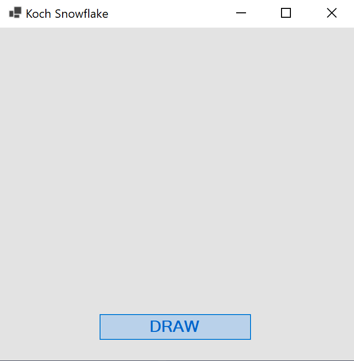
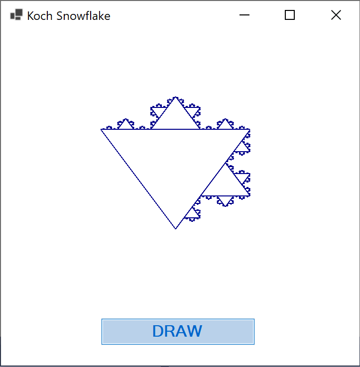

# KochSnowflake
A simple program to draw Koch snowflake.

## Technologies used in this project:

 

## Info:
The Koch snowflake (also known as the Koch curve, Koch star, or Koch island) is a fractal curve and one of the earliest fractals to have been described. It is based on the Koch curve, which appeared in a 1904 paper titled "On a Continuous Curve Without Tangents, Constructible from Elementary Geometry" by the Swedish mathematician Helge von Koch.

The project should be opened in **Microsoft Visual Studio**. Simply compile the project and run it. You will be presented with an interface.

  

Click on Draw and the snowflake fractal will be drawn.

  

In the end you will have the following result.

  

 

## Note

Feel free to download the project and build upon it. Happy coding!
